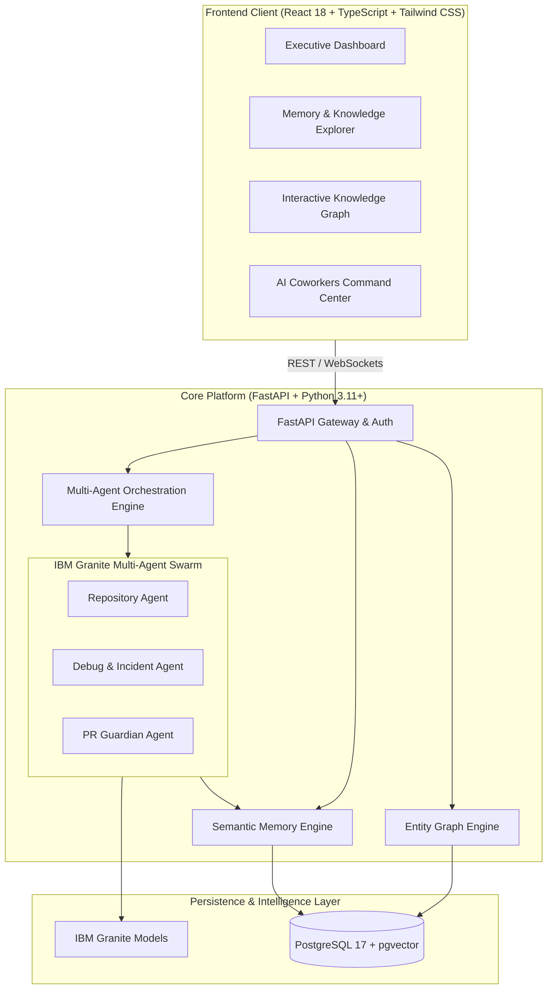

# 🧠 TeamMemoryOS — AI Operating System for Engineering Teams

## 📌 Problem Statement

Engineering teams suffer from severe **tribal knowledge loss** and **cognitive fragmentation**:
* **Lost Architectural Context:** Critical design decisions, incident post-mortems, and debugging breakthroughs are buried in ephemeral Slack chats, closed pull requests, and stale wikis.
* **Context Switching Overhead:** Developers spend 20–30% of their time hunting for code context, deciphering legacy rationales, or waiting for senior engineer reviews.
* **Stateless & Siloed AI Tools:** Generic AI assistants lack organizational memory, creating hallucinations, insecure recommendations, and repetitive prompting loops.

---

## 💡 Solution: What is TeamMemoryOS?

**TeamMemoryOS** is an intelligent, memory-augmented operating system that turns engineering knowledge from scattered artifacts into an **active, collaborative multi-agent coworker environment**.

```
  Tribal Knowledge & Code History ➔ [TeamMemoryOS Engine] ➔ Autonomous AI Coworkers & Living Knowledge Graph
```

### ✨ Core Capabilities
* 🧠 **Persistent Vector Memory Engine**: Ingests, embeds, and indexes code, ADRs (Architectural Decision Records), pull requests, and incidents with organization-scoped boundaries.
* 🤖 **Multi-Agent AI Coworker Swarm**: Specialized agents (Repository Agent, Debug Agent, PR Guardian, and Orchestrator) that autonomously analyze code, triage stack traces, and review PRs.
* 🕸️ **Interactive Knowledge Graph**: Dynamic graph exploration connecting developers, repositories, architecture decisions, and code dependencies.
* 🛡️ **PR Guardian & Compliance**: Pre-merge architectural compliance checks and automated vulnerability detection.
* ⚡ **Real-Time Engineering Copilot**: Dark-mode, glassmorphic command center with streaming agent chats grounded in organizational memory.

---

## 🤖 How IBM Bob & IBM Granite Were Used

TeamMemoryOS was developed from inception using **IBM Bob** as the primary AI engineering development tool, coupled with **IBM Granite** for runtime intelligence:

### 1. IBM Bob (Development Lifecycle & Pair Programming)
* **Skills & Rules Engine (`.bob/`)**: Built reusable `.bob/skills` and `.bob/rules` to enforce strict architectural constraints, UUID primary keys, and organization-scoped data isolation without prompt repetition.
* **8-Sprint Test-Driven Execution**: IBM Bob planned, scaffolded, and validated all 8 core milestones (FastAPI foundation, pgvector integration, multi-agent orchestration, and React frontend).
* **Security & Audit Logs**: Automated endpoint security auditing and continuous generation of sprint journals in `docs/development-journal/`.

### 2. IBM Granite (Runtime Application Intelligence)
* Powers contextual memory retrieval, semantic entity extraction, and multi-agent reasoning.
* Debug Agent to provide grounded, hallucination-free code analysis.

---

## 🏗️ System Architecture



---

## 🛠️ Technology Stack

| Layer | Technologies |
| :--- | :--- |
| **Primary Tool** | **IBM Bob** (Development, Scaffolding, Verification) |
| **Core AI** | **IBM Granite**, pgvector cosine/L2 semantic search |
| **Backend** | Python 3.11+, FastAPI, SQLAlchemy 2.0 (Async), Alembic, Pydantic v2 |
| **Database** | PostgreSQL 17 + `pgvector` containerized extension |
| **Frontend** | React 18, Vite, TypeScript, Tailwind CSS, Lucide Icons, Canvas Graph |

---

## 🚀 Getting Started

### Prerequisites
* Docker & Docker Compose
* Python 3.11+
* Node.js 18+ & npm

### 1. Clone & Start Database
```bash
git clone https://github.com/BP1202/TeamMemoryOs.git
cd TeamMemoryOs
docker-compose up -d
```

### 2. Start Backend
```bash
cd backend
python -m venv .venv
# On Windows:
.venv\Scripts\activate
# On Linux/macOS:
source .venv/bin/activate

pip install -r requirements.txt
uvicorn app.main:app --reload --port 8000
```
> API Docs available at `http://localhost:8000/docs`

### 3. Start Frontend
```bash
cd ../frontend
npm install
npm run dev
```
> Access the dashboard at `http://localhost:5173`

---

## 📂 Project Structure

```
TeamMemoryOS/
├── .bob/                     # Reusable IBM Bob skills and engineering rules
├── backend/
│   ├── app/
│   │   ├── agents/           # Multi-agent implementations (Repo, Debug, PR Guardian)
│   │   ├── api/              # FastAPI REST routers & auth endpoints
│   │   ├── core/             # Security, JWT, settings & DB engine
│   │   ├── db/               # Alembic migrations & session management
│   │   ├── memory/           # pgvector semantic indexing & retrieval
│   │   └── models/           # SQLAlchemy 2.x relational & graph models
├── frontend/
│   ├── src/ & features/      # React components (Dashboard, Chat, Agents, Graph)
├── docs/
│   ├── development-journal/  # Sprint-by-sprint IBM Bob engineering logs
│   └── ai-decisions/         # IBM Granite & Bob architectural records
├── docker-compose.yml        # PostgreSQL 17 + pgvector service
└── AGENTS.md                 # Engineering standards & handbook
```
---

# 🌍 The Vision Behind TeamMemoryOS

Software teams shouldn't lose knowledge every time a developer changes projects, leaves the company, or forgets how a critical production issue was solved.

**TeamMemoryOS** transforms engineering knowledge into a living organizational memory that continuously learns from incidents, architectural decisions, pull requests, and developer expertise. Every solved problem becomes reusable intelligence for the next engineer.

> **Build once. Learn forever. Never debug the same problem twice.**